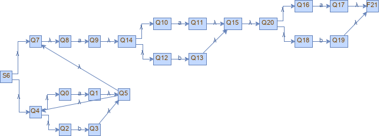

# RegexToNFA_Thomson-s_Algorithm
*This is a small java application which converts a regex in infix,prefix or postfix form to its equivalent NFA using Thomson's Algorithm.*

----------------------

> ## Explicatii Tema1(Ex3) - Tehnici de Compilare. 

In cadrul acestei aplicatii java am implimentat algoritmul de transformare a unui regex in forma infix prefix sau postfix folosind regulile Algoritmului Thompson. Pentru detalii accesati [urmatorul link](https://en.wikipedia.org/wiki/Thompson%27s_construction)

In cadrul aplicatiei user-ul are un mic menu, in care este capabil sa aleaga forma dorita (*prefix/infix/postfix*) si respectiv sa introduca regex-ul. Am implementat si o mica parte de validare a regexului, care verifica ca simbolurile aparute in regex sa fie valide conform formei alese. Deasemenea, aplicatia tine cont si de partea sintactica a regexului, asftel incat in cazul unui input gresit ca sintaxa, va impune userul sa introduca un input valid.

In cazul unui input valid, algoritmul construieste AFN-ul si deschide automat o fereastra in care prezinta graful rezultat. Mai mult ca atat, acesta va fi salvat intr-o poza de tip png in direcotrul src/main/resources sub numele 'NFA-Visualization.png'. Aveti mai jos un exemplu de AFN construit pentru urmatoarea expresie in forma infix (a|b)(star)a(a|b)(a|b) :

------------------------------------------------------------------------

## Detalii de implementare :
Pentru implementarea algoritmului am construit urmatoarele clase: 
 1. **NFA** * - aici se construieste AFN-ul propriu-zis*
 2. **State** * - reprezinta starea automatului
 3. **Transition** * - reprezinta o tranzitie in cadrul automatului

Clasa **NFA** are drept campuri : 
- regex-ul
- lista simbolurilor
- lista tranzitiilor
- lista starilor finale
- starea initiala, lista starilor
- un contor static pentru starile noi create
- stare in care mentin starea finala in cazul concatenarii
- stiva starilor de la care porneste tranzitia
- stiva starilor la care ajunge tranzitia.

In vederea simplificarii lucrului cu regex-ul, operez asupra acestui in forma postfix, deci transform regexul initial in forma sa postfix. Stivele joaca rolul principal in constuirea automatului, acestea permit legarea componentelor construite si formarea automatului.
Astfel, pentru fiecare caracter din regex in functie de tipul acestuia, simbol sau tipul operatorului, apelez functia corespunzatoare: 
 - *pentru simbol construiesc o simpla tranzitie de la o stare la alta adaugand noile stari in stive* 
 - *pentru operatorul* '|' *apelez metoda union care simuleaza regula de uniune din algortimul Thompson*
 - *pentru operatorul* 'star' *apelez metoda kleene care simuleaza regula kleene din algortimul Thompson* '*'
 - *pentru operatorul '.' apelez metoda concatenate care simuleaza regula de concatenare din algortimul Thompson* '.'

Pentru construirea grafica a AFN-ului am folosit libraria **jgrapht**. 
